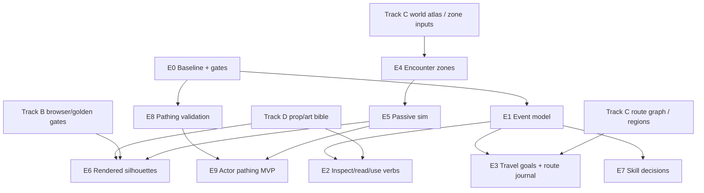

# 2026-05-09 Gameplay Exploration Implementation Plan

## Purpose

Track E moves the project from a rendering and world-generation tech demo toward a Morrowind-like exploration game. The goal is not combat or block-building breadth yet. The goal is a verified loop where the player reads the land, follows routes, inspects authored-procedural places, records discoveries, grows exploration skills, encounters simple world inhabitants, and can trust traversal through the generated world.

This plan is intentionally code-facing, but Wave 1 is documentation only. Runtime files are reserved until the current engine and LOD checkpoint lands.

## Current Baseline

Existing foundations:

- `ExplorationJournal` records biome, underground, regional variant, and landmark discoveries once, with recent discovery metadata and pending skill events.
- `SkillJournal` awards deterministic discovery XP, travel XP, level snapshots, and persisted travel remainders.
- `exploration-objectives` exposes staged exploration objectives around regions, landmarks, old-road signs, and underground biomes.
- `exploration-skill-effects` provides bounded Naturalist scan radius and Cartography/Spelunking travel speed effects.
- `GameController` exposes progress import/export, skill and journal snapshots, staged browser fixtures, route probes, and HUD/debug fields.
- `owned-browser-lab`, `verify-smoke`, route atlas, and route benchmark already validate progression persistence, travel skill movement, old-road objective advancement, route holes/seams, and frame budgets.

Non-goals for Track E:

- Do not make Minecraft-style block gathering/building the main loop.
- Do not add combat before passive zones, encounter simulation, pathing, and visibility are proven.
- Do not make a large quest log. Keep one active goal and a route/journal memory surface.
- Do not hide gameplay correctness behind subjective "feel"; every slice needs a deterministic signal.

## Track E Task IDs

| ID | Slice | Primary Output | Runtime Edit Phase |
| --- | --- | --- | --- |
| `E0` | Baseline and gates | Baseline artifacts and acceptance thresholds | Wave 1/2 |
| `E1` | Exploration event model | Pure event contract for discover/inspect/read/use/travel/zone events | Wave 2 |
| `E2` | Inspect/read/use verbs | Center-screen RPG interaction path | Wave 2 |
| `E3` | Travel goals and route journal | Route-goal state, journal notes, objective integration | Wave 2/3 |
| `E4` | Encounter zone descriptors | Deterministic zone query model | Wave 2/3, coordinated with Track C |
| `E5` | Passive NPC/mob sim harness | Data-only actor simulation and budgets | Wave 3 |
| `E6` | First rendered silhouettes | Low-cost actor/creature rendering and inspect hooks | Wave 4 |
| `E7` | Skill-driven exploration decisions | Bounded skill effects that change options, not only numbers | Wave 3 |
| `E8` | Pathing/physics validation | Route/path/stuck/collision probes | Wave 2/3 |
| `E9` | NPC/mob pathing MVP | Simple local steering and collision-safe actor movement | Wave 4 |

## Dependency Graph



## Implementation Contracts

### E1 Exploration Event Model

Add a pure engine contract before controller/UI integration.

Candidate event shape:

```ts
type ExplorationEventKind =
  | "discover"
  | "inspect"
  | "read"
  | "use"
  | "enter-zone"
  | "complete-travel-goal"
  | "encounter";

interface ExplorationEvent {
  key: string;
  kind: ExplorationEventKind;
  subjectId: string;
  subjectType: "biome" | "underground" | "regional-variant" | "landmark" | "route" | "zone" | "npc" | "mob" | "object";
  role: string;
  name: string;
  flavorText: string | null;
  worldPosition?: [number, number, number];
  sequence: number;
}
```

Rules:

- `key` is the idempotency boundary. A route marker can be inspected many times but should only award first-inspect XP once unless explicitly marked repeatable.
- `sequence` remains the chronological journal order.
- Discovery events stay compatible with the existing journal and skill pipeline.
- Inspect/read/use events may feed route journal notes and skill awards, but should not spam recent discovery toasts.
- Event import must sanitize unknown fields and preserve forward-compatible payloads only where explicitly allowed.

Initial event categories:

- `discover`: current biome/variant/landmark/underground discovery.
- `inspect`: close look at landmark, shrine, travel pack, sign, creature track, cave sign.
- `read`: old-road inscription, shrine marker, route cairn.
- `use`: shrine blessing, route mark, camp/rest marker, travel-pack note.
- `enter-zone`: encounter zone or named region threshold.
- `complete-travel-goal`: route leg completion.
- `encounter`: passive NPC/mob first sighting.

Tests:

- `tests/exploration-events.test.ts`: idempotency, ordering, import/export, repeatable-vs-once behavior.
- Extend `tests/exploration-journal.test.ts`: discovery compatibility and pending skill drains.
- Extend `tests/skill-journal.test.ts`: first-read/first-use awards are once-only.

Acceptance:

- Replaying the same event batch twice changes no XP or objective counts on the second pass.
- Import/export round trip preserves event order, subject ids, and current journal state.
- Unknown event kinds are ignored or preserved according to a documented version rule, not executed.

### E2 Inspect/Read/Use Verbs

Replace player-facing block interaction with exploration verbs.

Interaction query:

- Use the existing center-screen ray/camera path.
- Resolve nearest eligible exploration target in reach.
- Target types: landmark root, route object, shrine, note/sign object, passive actor.
- Output one authoritative interaction snapshot for HUD and browser tests.

Verb rules:

- `inspect`: available for most landmarks/actors; creates a journal note and can trigger Naturalist/Lore XP.
- `read`: available only on authored route/sign/shrine subjects; adds route journal text.
- `use`: available only when the object has an explicit effect; early effects should be low-risk, such as "mark route", "record shrine", or "rest note", not teleport/combat.

UI rules:

- Bottom HUD shows one verb prompt and target name.
- No hotbar, block material, break/place prompt, or inventory panel should be visible in normal gameplay.
- Verb text must come from the authoritative interaction snapshot, not duplicated DOM logic.

Tests:

- `tests/rpg-ui-cleanup.test.ts`: continue asserting removed Minecraft UI surfaces do not return.
- New `tests/exploration-interactions.test.ts`: pure target resolution and verb availability.
- Browser probe: teleport near `silt_shell`, `velothi_shrine`, or `old_road_causeway`, point at target, perform key/click, assert event and route/objective effect.

Acceptance:

- At least one `inspect`, one `read`, and one `use` path is verified end to end in browser.
- Interaction snapshot includes `targetId`, `targetName`, `verb`, `distanceMeters`, `enabled`, and `disabledReason`.
- `verify-smoke` reports interaction probe success without route holes, LOD gaps, or frame-budget regression.

### E3 Travel Goals And Route Journal

Turn objective breadcrumbs into route goals.

Data model:

- `TravelGoal`: stable id, route id, stage id, start condition, target condition, progress, target label, journal text.
- `RouteJournalEntry`: event key, title, text, world position, route id, optional skill hint.
- `RouteMemory`: discovered route markers, completed route legs, last seen target, active goal id.

Goal types:

- `find-old-road-sign`: discover or inspect old-road landmark.
- `follow-pilgrim-road`: visit multiple route markers in order or within region.
- `enter-undercroft`: cross underground validation and discover underground biome.
- `map-region`: discover biome/variant set within route envelope.
- `return-to-shrine`: revisit a marked shrine or route object.

Rules:

- Only one active goal is shown in the HUD.
- Journal can retain multiple route notes but should stay compact.
- Goals must be completable from staged browser fixtures and from at least one route-atlas path.

Tests:

- Extend `tests/exploration-objectives.test.ts` for route-goal stage transitions.
- New `tests/route-journal.test.ts` for journal import/export and completion ordering.
- Extend browser staged fixtures: one fixture before goal, one after partial goal.
- Route atlas: report candidate target distances and max goal gap.

Acceptance:

- Browser lab advances one route goal from partial to complete using a live target.
- `route-atlas` reports at least one valid target path for every active goal stage.
- Objective progress and route journal state survive save/load.

### E4 Encounter Zone Descriptors

Add zones before actors.

Descriptor shape:

```ts
interface EncounterZone {
  id: string;
  regionId: string | null;
  biomeId: string | null;
  landmarkId: string | null;
  center: [number, number];
  radiusMeters: number;
  tier: 1 | 2 | 3;
  tags: readonly string[];
  npcBudget: number;
  mobBudget: number;
  behavior: "pilgrim" | "forager" | "territorial" | "ambient" | "guardian";
}
```

Zone sources:

- Old-road route markers: pilgrims, travel packs, shrine keepers later.
- Ash/kwama landmarks: ambient mobs and territorial fauna later.
- Wetlands/fungal/caves: passive creature zones and underground warnings.
- Region graph from Track C once available.

Rules:

- Zone query must be deterministic from seed and world position.
- Initial zones are data-only: no rendered actor, no collision, no combat.
- Zone budgets must cap total nearby actors before simulation exists.

Tests:

- New `tests/encounter-zones.test.ts`: determinism, radius, biome/landmark affinity, budget caps.
- Extend `scripts/route-atlas.ts`: aggregate zone cadence, zone gap, route-affinity tags.

Acceptance:

- Fixed route atlas reports encounter-zone hits on old-road and cave routes.
- Max zone gap is recorded, not guessed.
- Zone descriptors do not require resident chunk generation beyond existing summary/worldgen queries.

### E5 Passive NPC/Mob Simulation Harness

Data-only actors first.

Simulation rules:

- Actors spawn from `EncounterZone` descriptors with stable per-zone ids.
- Actors have position, kind, zone id, display name, passive state, and interaction availability.
- No combat, no damage, no inventory drops.
- Early states: `idle`, `watch`, `wander`, `flee`, `approach`, `talk`.
- Sim updates are budgeted and can be disabled in benchmark mode if needed.

Tests:

- New `tests/encounter-simulation.test.ts`: deterministic spawn, cap enforcement, despawn outside radius, save/load for named discoveries.
- Browser debug snapshot: nearby actor count, zone count, sim ms.
- Route benchmark: sim p95/avg cost added to measured work accounting.

Acceptance:

- 30-second deterministic sim has stable actor counts and no unbounded growth.
- `avgEncounterSimMs` and `p95EncounterSimMs` stay under explicit budget, initially `0.5 ms avg` and `2 ms p95` on smoke routes.
- Passive actor first-sighting can produce an `encounter` event once.

### E6 First Rendered NPC/Mob Silhouettes

Only after data-only sim and render gates are stable.

Rendering approach:

- Start with very cheap billboards or low-voxel impostors.
- Reuse Track D art direction and object-lab acceptance for readable silhouettes.
- Actor rendering must be optional in debug if it destabilizes harnesses.

Tests:

- Golden/screenshot check near one controlled actor.
- Browser lab verifies nonblank actor pixels near known target.
- Route benchmark reports draw calls/triangles/actor count.

Acceptance:

- One pilgrim-like NPC and one ambient mob silhouette can be seen and inspected.
- No route p95 gameplay-frame regression above 5%.
- No new LOD gaps, handoff holes, or visible route holes.

### E7 Skill-Driven Exploration Decisions

Skills should change what the player can learn or choose, not only numeric speed.

Candidate effects:

- Cartography: mark active route goal from farther away; reveal route direction after enough old-road reads.
- Naturalist: identify passive mob/landmark signs earlier; distinguish harmless vs territorial zones.
- Spelunking: identify cave safety, underground direction, or air/exit hints.
- Lore: decode shrine/route inscriptions into better journal text or alternate goal hints.

Rules:

- Effects are bounded and pure in `exploration-skill-effects` style.
- Every effect must have low/high skill staged fixture coverage.
- No effect should force a player into a route; it should reveal or clarify options.

Tests:

- Extend `tests/exploration-skill-effects.test.ts`.
- Extend `tests/skill-journal.test.ts` for new event awards.
- Browser staged fixture: low-skill vs high-skill visible outcome.

Acceptance:

- At least one skill-gated information outcome is browser verified.
- Effects are exposed in debug snapshot for harness assertions.
- Movement and scan costs remain within existing route budgets.

### E8 Pathing And Physics Validation

This is validation before NPC pathfinding.

Validation targets:

- Player step and collision over route materials.
- Max surface discontinuity along route centerlines.
- Stuck frames during controlled movement.
- Water entry/exit and underground entry.
- Boosted movement does not overshoot collision.
- Route goals are physically reachable from fixture starts.

Harness additions:

- `travel-path-validation` pure route sampler over generated terrain.
- Browser route path probe: records stuck frames, collision flags, surface gap count, max step/drop, water/cave transitions.
- Artifact fields in owned browser lab and route benchmarks.

Tests:

- Extend `tests/player-physics.test.ts`.
- Extend `tests/game-route-benchmark.test.ts`.
- New `tests/travel-path-validation.test.ts`.

Acceptance:

- Fixed smoke routes have `0` stuck frames after initial stream settle.
- Max route surface step/drop stays under route-specific threshold.
- Boosted movement remains collision-safe.
- Browser path probe can prove one old-road travel goal is reachable.

### E9 NPC/Mob Pathing MVP

Only after E5 and E8.

Movement rules:

- Local steering within zone radius.
- Avoid solid voxels using cheap occupancy probes.
- Actor movement can be low frequency, for example 4-10 Hz sim ticks.
- No global pathfinding until route graph and finite island work stabilize.

Tests:

- New `tests/actor-pathing.test.ts`: no actor ends inside collision, stays in zone, deterministic trajectory.
- Sim harness: 30-second zone run with CPU budget.
- Browser: one actor wanders or faces player near a known route marker.

Acceptance:

- Actors do not enter solid voxels in deterministic sim.
- Actor sim p95 remains under budget.
- Actor movement does not perturb player route benchmark gates.

## Acceptance Metrics

Track E changes should report these metrics where relevant:

| Metric | Gate |
| --- | --- |
| Blocking seam frames | `0` in smoke route |
| Visible hole/screen void frames | `0` in smoke route |
| Final LOD gaps/handoff holes | `0` |
| Progress persistence | import/export and localStorage round trip pass |
| Route goal browser probe | partial state advances to completed state |
| Interaction browser probe | inspect/read/use each produce expected event |
| Discovery cadence | route atlas records max notable/goal gap |
| Zone cadence | route atlas records zone hits and max zone gap |
| Encounter sim cost | initial budget `avg <= 0.5 ms`, `p95 <= 2 ms` |
| Route frame cost | no more than 5% p95 regression per gameplay slice |
| Actor counts | deterministic and capped by zone budget |
| Stuck frames | `0` after settle on canonical routes |

## First Slices

### Slice E0.1: Baseline Artifact

Do first after engine checkpoint.

Commands:

- `mise exec -- bun run typecheck`
- `mise exec -- bun test tests/exploration-journal.test.ts tests/skill-journal.test.ts tests/exploration-objectives.test.ts tests/exploration-skill-effects.test.ts tests/player-physics.test.ts tests/game-route-benchmark.test.ts`
- `mise exec -- bun run scripts/route-atlas.ts --label=track-e-baseline`
- `mise exec -- bun run scripts/verify-smoke.ts --label=track-e-baseline`

Output:

- Baseline artifact paths recorded in the diary.
- Current route p95, route holes/seams, objective stage, travel skill delta, and route atlas cadence.

### Slice E1.1: Pure Event Model

Files likely touched:

- New `src/engine/exploration-events.ts`
- New `tests/exploration-events.test.ts`
- Focused additions to `src/engine/exploration-journal.ts`, `src/engine/skill-journal.ts`, and their tests.

Keep controller/UI out of the first PR unless the pure model is trivial.

Acceptance:

- Event import/export, idempotency, and skill awards pass.
- Existing journal/skill tests remain green.

### Slice E2.1: One Inspect Verb

Files likely touched:

- `src/client/game-controller.ts`
- `src/client/game.ts`
- `tests/rpg-ui-cleanup.test.ts`
- Browser lab probe code.

Target:

- Inspect one known landmark in a staged browser fixture.
- Produce an `inspect` event and route journal note.

Acceptance:

- Browser fixture verifies event and no Minecraft UI regression.
- No route/perf correctness regression.

### Slice E3.1: Route Goal State

Files likely touched:

- New `src/engine/route-journal.ts` or `src/engine/travel-goals.ts`
- `src/engine/exploration-objectives.ts`
- Tests and staged fixtures.

Target:

- Convert old-road breadcrumb into a route-goal contract while preserving current objective behavior.

Acceptance:

- Current old-road browser probe still passes.
- Route goal state persists and can be asserted from `window.__VOXELS_GAME__`.

### Slice E8.1: Path Validation Harness

Files likely touched:

- New pure test helper under `src/engine` or `scripts/lib`.
- `tests/travel-path-validation.test.ts`
- Later browser lab fields.

Target:

- Prove canonical old-road route samples are physically traversable enough for future travel goals.

Acceptance:

- Pure route path validation reports max step/drop and no impossible segments for the smoke route.

## Parallelizable Subtasks

- `E1` pure event model can proceed independently after runtime edit freeze lifts.
- `E8` pure path validation can proceed alongside `E1` because it depends on physics/worldgen, not event integration.
- `E4` encounter zone descriptor design can proceed as a pure worldgen query once Track C route/region shape is clear.
- `E2` UI interaction and Track D HUD tone can be designed in parallel, but runtime integration should wait for `E1`.
- `E5` passive sim can begin with mock zones while `E4` is still stabilizing, then swap to real zone descriptors.

## Cross-Track Dependencies

- Track A: durable progress and future canonical chunk storage should not be blocked by Track E, but route/interaction state must remain serializable and versioned.
- Track B: browser/golden gates are required before rendered actors in `E6`.
- Track C: route graph, finite island, region ids, and cave graph are required for robust `E3/E4` beyond compatibility mode.
- Track D: art bible and prop kits should define the readable subjects for `inspect/read/use` and actor silhouettes.
- Engine checkpoint: do not edit reserved runtime files until current LOD/storage work is clean.

## Risks And Mitigations

- Risk: interaction verbs become a hidden quest system.
  - Mitigation: one active goal, compact route journal, pure event contracts.
- Risk: actor simulation creates frame spikes.
  - Mitigation: data-only sim first, explicit `avg/p95` sim fields, capped zone budgets.
- Risk: pathing work expands into full navmesh before the world graph exists.
  - Mitigation: local voxel probes and route validation first; no global actor pathing until Track C route graph stabilizes.
- Risk: skill effects destabilize movement/streaming.
  - Mitigation: keep current small caps, add high-skill staged fixtures, run route p95 gates.
- Risk: worldgen route targets are not reachable or not visible.
  - Mitigation: route atlas must prove target cadence and path validation must prove physical reachability.
- Risk: docs diverge from implementation.
  - Mitigation: each completed slice updates this plan or the Morrowind diary with artifact paths, final commands, and rubric movement.

## Done Definition For Track E Foundation

Track E reaches foundation complete when:

- `inspect`, `read`, and `use` are each verified end to end.
- At least one travel goal can be completed from a staged browser fixture and persists through reload.
- Route journal records meaningful notes without becoming a large quest log.
- Skills produce at least two browser-verified exploration decisions, not only XP numbers.
- Encounter zones are deterministic and visible in route atlas output.
- Passive actors can be simulated within budget and inspected or encountered once.
- Path validation proves canonical routes are traversable and reports failures with actionable samples.
- `verify-smoke` remains green with `0` blocking seams, `0` visible holes, `0` final LOD gaps, and no material route p95 regression.
