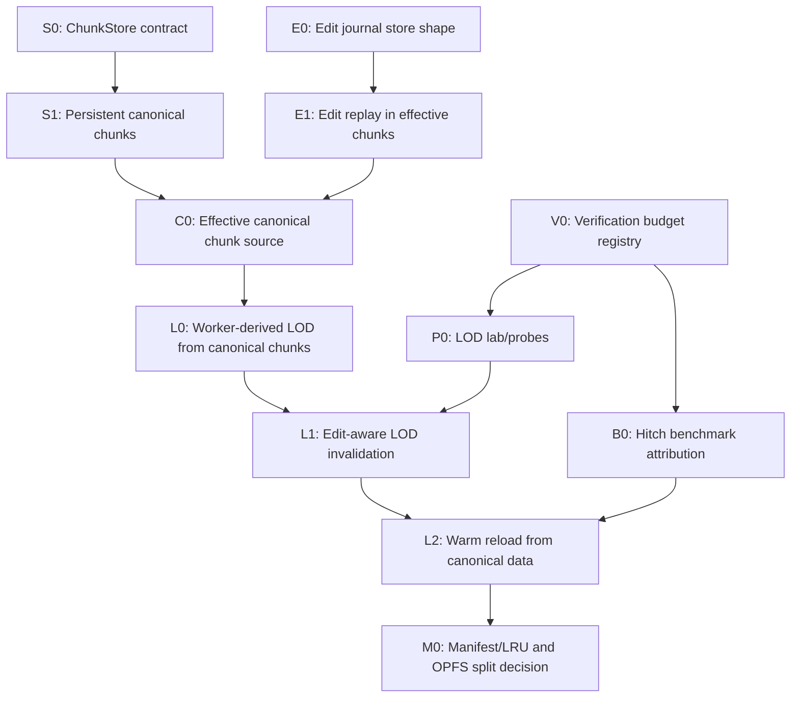

# 2026-05-09 LOD, Storage, and Verification Roadmap

## Purpose

This roadmap turns the long-term voxel RPG engine target into concrete storage, LOD, lab, and benchmark work. The goal is not to add another cache layer. The goal is to make one durable world authority that can support:

- warm reloads from persisted canonical chunks;
- persisted edit journals that survive reload and feed every derived representation;
- worker-derived LOD built from effective canonical chunks, not render-time generator guesses;
- LOD lab and production probes that catch gaps, overlaps, stale edits, and handoff stalls;
- hitch benchmarks that explain where frame spikes come from before content work is accepted.

This document is intentionally code-facing, but it is a roadmap only. It does not change code.

## Local Context

Existing repo seams to build on:

- `src/client/procedural-generated-chunk-cache.ts` already persists generated chunk payloads, chunk summaries, render-summary regions, and optional derived LOD chunks in IndexedDB.
- `src/engine/generated-chunk-codec.ts` stores canonical generated chunks as `32^3` payloads split into `8^3` subchunks.
- `src/engine/derived-lod-chunk-codec.ts` can encode derived LOD chunks, but those payloads must stay disposable render artifacts.
- `src/engine/chunk-edit-journal.ts` already defines pure packed edit deltas, replay, import/export, and compaction.
- `src/engine/lod-chunk-derivation.ts` has the current downsampling surface for LOD chunk data.
- `src/engine/procedural-resident-world.ts` owns active/prepared/retained LOD state, disk-cache counters, pending attribution, and visible ownership.
- `src/client/procedural-generation-worker.ts` and `src/client/async-procedural-chunk-generation.ts` are the current async worker bridge.
- `src/client/lod-lab.ts` and `src/engine/lod-debug-world.ts` provide the synthetic LOD lab path.
- `scripts/run-browser-game-benchmarks.ts`, `scripts/run-render-verification.ts`, `scripts/run-voxel-rpg-verification.ts`, `scripts/profile-lod-cache-reuse.ts`, and `scripts/analyze-chrome-trace.ts` are the current benchmark and verification entry points.

Relevant local docs:

- `docs/loop/20260509-canonical-lod-architecture.md`: canonical chunks plus edit deltas are durable; summaries and LOD are derived.
- `docs/loop/20260508-lod-storage-redesign.md`: derived LOD retention, IndexedDB LOD cache, browser persistence proof, pending attribution, fog-footprint planning.
- `docs/loop/20260508-engine-decomposition.md`: LOD lab requirements and source-of-truth split.
- `docs/loop/far-render-architecture.md`: surface far renderer plus future volumetric visibility from chunk summaries.
- `docs/loop/20260509-master-execution-plan.md` and `docs/loop/20260509-subagent-execution-board.md`: render correctness and verification gate content acceptance.

Research docs read:

- `/Users/blixt/Downloads/deep-research-report (2).md`
- `/Users/blixt/Downloads/geminivoxelresearch.md`

Research implications used here:

- Sub-meter and 10 cm voxel worlds make dense world storage untenable. A `1 km^3` world at 10 cm resolution implies `10^12` possible cells before material data.
- Near-field gameplay voxels should stay chunk-sparse and directly editable. Compression-domain structures are better as later layers for static or repeated content.
- LOD is a residency policy, not only mesh simplification. Coarser chunks should be streamed and selected deliberately before expensive fine detail.
- Fixed-resolution LOD tiers aggregated from child chunks are a practical stepping stone toward larger GPU-driven systems.
- Far-field stochastic or atmospheric detail should remain procedural where possible; not every distant visual detail should become explicit voxel storage.
- Continuous editing is the hardest unresolved area in public voxel literature, so edit-aware invalidation and verification are not optional.

## Non-Negotiable Invariants

1. The canonical material at a voxel is:
   `generated base chunk + persisted edit journal + live edit overlay`.
2. Canonical chunks and edit journals are the only durable world authority.
3. Chunk summaries, render-summary regions, retained LOD chunks, and disk LOD chunks are derived and disposable.
4. A derived LOD cache miss must never change correctness. It can only affect speed.
5. A derived LOD cache hit is valid only when generation version, world key, LOD key, and edit revision match.
6. Prepared, retained, stale, or pending chunks must not render unless the ownership state explicitly makes them active.
7. LOD handoff correctness is measured by ownership probes, not by screenshots alone.
8. Every storage or LOD checkpoint must include a cold run, a warm run, and an edit invalidation run before it is treated as production-safe.

## Measurable Budgets

These are first acceptance budgets. They should tighten after reliable artifacts exist.

| Area | Budget | Measurement |
| --- | ---: | --- |
| LOD gaps | `0` | `uncoveredGapCount`, lab `gaps`, route hole signals |
| Handoff holes | `0` | `handoffHoleCount` |
| Resident overlaps | `0` | `residentOverlapCount` |
| LOD band overlaps | `0` | `bandOverlapCount` |
| Water overlaps | `0` | `waterOverlapCount` |
| Far stress generation backlog | `0` final `pendingGenerationBudget` | `bench:lod-persistence -- --lod-persistence-chunk-delta=32` |
| Prepared backlog | `0`, or explicitly classified non-visible | same artifact pending breakdown |
| Default LOD reload hits | `>= 32` reload disk hits | default `bench:lod-persistence` |
| Warm canonical chunk reuse | `>= 90%` of revisited required chunks hit disk | cache-reuse or new canonical reload probe |
| Edit journal replay determinism | byte-identical replay across two reloads | unit and browser edit-reload probe |
| Edit invalidation latency | affected derived LOD stale by next residency update; rebuilt within `120` frames in smoke | LOD edit probe |
| Frame hitch ceiling | `0` frames over `50 ms` in default route smoke | `trace:route`, `bench:browser-game`, `verify:rpg` |
| Gameplay frame p95 | `<= 16.67 ms` in route smoke; `<= 22 ms` allowed in stress | route sample CSV |
| LOD chunk slice max | `<= 8 ms` default, `<= 12 ms` stress | HUD/probe LOD slice fields |
| Browser storage main-thread writes | `0` synchronous write/encode work above `4 ms` per frame | hitch attribution plus trace |
| LOD lab frame hitches | `0` recent hitches after settle | `test:lod-lab` and in-browser lab snapshot |

If a budget fails, the checkpoint can still land as a diagnostic improvement only when the artifact explains the failed bucket and no correctness gate regresses.

## Dependency Graph



## Parallel Work Lanes

The work can proceed in parallel if each lane respects ownership boundaries.

| Lane | Can start now | Blocks on | Do not touch until unblocked |
| --- | --- | --- | --- |
| Storage contract | API docs, record shapes, migration tests | none | production eviction policy changes |
| Edit journal | store shape, append/compact tests, replay probes | none | live edit UI or gameplay behavior |
| Worker LOD | request/response shape tests, pure derivation fixtures | effective chunk source | production scheduling changes |
| LOD lab/probes | synthetic edit/reload probes, budget registry | none | renderer semantics unless a bug is proven |
| Benchmark hitches | artifact schema, pending-source split, trace analyzer fields | none | performance constants without before/after artifacts |
| Manifest/OPFS | design and sizing experiments | canonical chunk reuse proven | replacing IndexedDB payload path |

## Roadmap Phases

### Phase 0 - Baseline Freeze

Purpose: preserve the current truth before changing storage semantics.

Tasks:

- `P0.1`: Capture current default LOD persistence artifact.
  - Command: `mise exec -- bun run bench:lod-persistence -- --label=roadmap-baseline-default`
  - Gate: pass with `0` gaps/overlaps and at least the current `32` reload disk hits.
- `P0.2`: Capture current far transition artifact.
  - Command: `mise exec -- bun run bench:lod-persistence -- --label=roadmap-baseline-far --lod-persistence-chunk-delta=32 --lod-persistence-max-frames=260`
  - Gate: `0` visible gaps/overlaps; pending attribution included even if settle budget fails.
- `P0.3`: Capture current LOD lab and route hitch baselines.
  - Commands:
    - `mise exec -- bun run test:lod-lab`
    - `mise exec -- bun run trace:route -- --label=roadmap-baseline-route --duration=10 --settle=2 --sample-hz=60`
  - Gate: route artifact includes p95/max frame, frames over `50 ms`, hole signals, and LOD slice fields.
- `P0.4`: Record artifact paths in `docs/loop/verification.md`.

Dependencies: none.

Parallelizable: all baseline commands can be run by a verification worker while storage design continues.

### Phase 1 - ChunkStore Contract and Persistent Canonical Chunks

Purpose: promote the current generated chunk cache into an engine-facing canonical store without yet replacing all internals.

Tasks:

- `S1.1`: Define `ChunkStore` types around the existing cache:
  - canonical world key: generation version, seed, sea level, chunk size, max Y, and chunk coord;
  - `getCanonicalChunk`, `putCanonicalChunk`, `getChunkSummary`, `putChunkSummary`, `getRegionSummary`;
  - explicit `close`;
  - no derived LOD authority in the core interface.
- `S1.2`: Add versioned record metadata to persistent chunk records:
  - `generationVersion`;
  - `canonicalRevision`;
  - `encodedByteLength`;
  - `storedAt`;
  - schema version.
- `S1.3`: Preserve backwards compatibility with the current IndexedDB stores:
  - `chunks`;
  - `chunk_summaries`;
  - `render_summary_regions`;
  - `lod_chunks` as optional derived cache only.
- `S1.4`: Add a canonical reload probe:
  - clear storage, generate required chunks, reload without clearing storage, measure required chunk hits;
  - report total required chunks, disk hits, generated misses, decode time, and per-frame max decode cost.
- `S1.5`: Add region-summary warm reuse reporting:
  - report region summary hits separately from chunk summary hits;
  - fail only when a required summary is stale or inconsistent, not when a cache is legitimately cold.

Dependencies:

- `P0.1` and `P0.2` artifacts captured first.

Parallelizable:

- Type definitions, record-shape tests, and benchmark schema work can happen in parallel.
- Production wiring should be one narrow checkpoint after tests are green.

Verification gates:

- `mise exec -- bun run typecheck`
- `mise exec -- bun test tests/generated-chunk-codec.test.ts tests/procedural-deferred-persistence.test.ts tests/async-chunk-generation.test.ts`
- New canonical store tests covering negative chunk coordinates, empty chunk records, and version mismatch misses.
- Browser canonical reload probe:
  - warm hit ratio `>= 90%` for required revisited chunks;
  - no correctness gaps;
  - max single-frame decode/adopt cost `<= 8 ms`.

Budget notes:

- `32^3` dense chunk payloads are acceptable only behind the existing subchunk codec.
- Empty chunks must store or report as known-empty records, not as ambiguous misses.
- Main-thread adoption may decode only within the frame budget; large batches must be worker-owned or sliced.

### Phase 2 - Persistent Edit Journals

Purpose: make edits durable without creating a second full-chunk authority.

Tasks:

- `E2.1`: Add a persistent edit-journal record shape:
  - `worldKey`;
  - chunk coord;
  - `baseGenerationVersion`;
  - `minRevision`;
  - `maxRevision`;
  - packed deltas;
  - `storedAt`;
  - optional compaction marker.
- `E2.2`: Add store methods:
  - `getEditJournal(coord)`;
  - `appendEditDeltas(coord, deltas, revision)`;
  - `compactEditJournal(coord, upToRevision)`;
  - `getChunkEditRevision(coord)`.
- `E2.3`: Build an `EffectiveCanonicalChunk` helper:
  - load canonical chunk from memory, disk, or generator;
  - apply persisted journal;
  - apply live overlay supplied by caller;
  - recompute `solidCount`, `solidBounds`, and `renderSummary`;
  - expose `canonicalRevision` and `appliedEditCount`.
- `E2.4`: Add edit journal persistence tests:
  - repeated voxel overwrite compacts to final material;
  - replay order is deterministic;
  - journals import/export cleanly;
  - negative chunk coords are stable;
  - empty-to-solid and solid-to-air edits refresh summaries.
- `E2.5`: Add browser edit-reload probe:
  - apply an edit in LOD0;
  - persist journal;
  - reload;
  - verify LOD0 material, summary, and derived LOD material reflect the edit.

Dependencies:

- `S1.1` record key contract.
- Existing pure `src/engine/chunk-edit-journal.ts` remains the pure implementation base.

Parallelizable:

- Pure journal tests and browser probe harness can be written before production storage is wired.
- Summary invalidation tests can be built against fake stores.

Verification gates:

- `mise exec -- bun test tests/chunk-edit-journal.test.ts`
- New effective chunk tests covering generated, disk, memory, and edited sources.
- Browser edit-reload probe:
  - edited LOD0 material survives reload;
  - affected summaries carry the new revision;
  - stale derived LOD cache is ignored;
  - no unchanged neighboring chunk is invalidated unnecessarily.

Budget notes:

- Append cost target: `<= 2 ms` per frame for typical single-interaction edits.
- Compaction target: background/sliced; no frame above `8 ms` attributed to compaction.
- Edit replay target for one chunk: `<= 2 ms` for sparse journals under `4096` voxel edits; larger journals must trigger compaction or chunk snapshot consideration.
- Journal size warning: warn when a chunk journal exceeds `25%` of its encoded canonical chunk byte size.

### Phase 3 - Worker-Derived LOD From Effective Canonical Chunks

Purpose: make LOD derivation consume effective canonical data instead of sampling a live generator or stale derived payloads.

Tasks:

- `L3.1`: Define worker request/response shapes for canonical LOD derivation:
  - LOD level;
  - output coord;
  - source footprint;
  - target canonical revision;
  - live edit overlay batch if needed;
  - source stats: generated chunks, disk hits, edit deltas applied, known-empty hits, decode ms, derive ms.
- `L3.2`: Move source-footprint assembly into a testable helper.
  - Given LOD level and output coord, produce exact base chunk footprint.
  - Include Y range and chunk bounds.
- `L3.3`: Derive from `EffectiveCanonicalChunk` data.
  - All material samples come from generated/disk chunks with journals replayed.
  - Missing chunks may be generated by the worker and persisted as canonical chunks.
  - Empty source footprints return explicit empty LOD chunks.
- `L3.4`: Keep derived LOD disk cache optional.
  - Cache key includes LOD level, output coord, generation version, and edit revision.
  - Cache hit adoption still clips against current active finer coverage.
  - Clearing `lod_chunks` must not change visible output.
- `L3.5`: Add edit-aware invalidation:
  - every edit marks intersecting LOD footprints stale;
  - stale chunks can remain visible only until a valid replacement is prepared;
  - retained and disk-derived chunks with old revisions are ignored.

Dependencies:

- `E2.3` effective chunk helper.
- `S1.4` canonical reload metrics.

Parallelizable:

- Footprint math and derivation fixtures can proceed while storage integration lands.
- Worker scheduling and disk cache policy should wait until source correctness is proven.

Verification gates:

- `mise exec -- bun test tests/lod-chunk-derivation.test.ts tests/derived-lod-chunk-codec.test.ts tests/lod-handoff.test.ts`
- New worker derivation tests:
  - missing disk chunk generates once and persists;
  - edited child chunk changes parent LOD material;
  - stale derived LOD cache is rejected;
  - known-empty footprint returns explicit empty result.
- Browser probes:
  - default LOD persistence still gets `>= 32` reload disk hits or an explained replacement metric;
  - edit reload shows edited material in far LOD after replacement;
  - far stress remains `0` gaps/overlaps.

Budget notes:

- Per-frame worker completion adoption budget: `<= 4` LOD chunks or `<= 8 ms`, whichever comes first.
- Per-derived-chunk main-thread work target: `<= 1 ms`; encoding/decoding should be worker-side or sliced.
- Cold far-window disk probes: cap outstanding misses so `pendingDiskCache <= 64` after settle.
- Large far transition target after optimization: final `pendingGenerationBudget = 0` within `260` frames.

### Phase 4 - LOD Lab and Production Probes

Purpose: make bad LOD ownership and stale edit propagation obvious in synthetic and real scenes.

Tasks:

- `V4.1`: Expand `LOD Lab` scenarios:
  - staged handoff with missing finer chunks;
  - retained chunk reuse;
  - disk-derived chunk reuse;
  - far edit invalidation;
  - reload after edit;
  - large camera jump.
- `V4.2`: Add probe fields to lab snapshots:
  - active/prepared/retained/stale chunk counts;
  - pending split by planning, disk cache, generation budget, partial build, prepared, invalidated eviction;
  - max per-phase ms for plan, complete, handoff, render, HUD;
  - last visible ownership violation sample.
- `V4.3`: Add production route LOD probes:
  - capture LOD ownership per route sample;
  - separate correctness failures from settle-budget failures;
  - record a minimal reproduction command in artifact JSON.
- `V4.4`: Add a golden edit probe:
  - apply deterministic edit in a known route/golden view footprint;
  - capture before/after summary hash;
  - verify only intersecting derived records invalidate.
- `V4.5`: Centralize budgets in `scripts/lib/voxel-rpg-budgets.ts`.
  - Use the same thresholds from lab, render verification, route trace, and browser game benchmark.

Dependencies:

- Can start now with current fields.
- Edit-aware scenarios need Phase 2.

Parallelizable:

- Budget registry and artifact schema can proceed independently.
- Synthetic lab scenarios can be added before production route probes.

Verification gates:

- `mise exec -- bun run test:lod-lab`
- `mise exec -- bun run verify:render`
- `mise exec -- bun run verify:rpg`
- Lab and route artifacts must report:
  - `0` gaps;
  - `0` overlaps;
  - recent hitches;
  - pending attribution;
  - exact command line;
  - artifact paths.

Budget notes:

- LOD lab is allowed lower average FPS than the game, but it is not allowed hidden gaps, overlaps, or unclassified `>= 50 ms` frame spikes after settle.
- Any stress mode may have a separate settle budget, but correctness counts must remain strict.

### Phase 5 - Benchmark Hitches and Scheduling

Purpose: prevent storage and LOD from creating intermittent movement hitches that screenshots miss.

Tasks:

- `B5.1`: Extend benchmark artifacts with hitch buckets:
  - frames over `16.67 ms`;
  - frames over `33.33 ms`;
  - frames over `50 ms`;
  - max RAF delta;
  - recent stalled ms;
  - dropped-frame estimate.
- `B5.2`: Attribute hitches by subsystem:
  - chunk generation;
  - canonical chunk decode;
  - edit replay;
  - derived LOD decode;
  - derived LOD build;
  - meshing;
  - render upload;
  - handoff/commit;
  - HUD/debug sampling.
- `B5.3`: Add cold/warm comparison for benchmark hitches:
  - cold storage clear;
  - warm reload;
  - warm return trip;
  - edit invalidation trip.
- `B5.4`: Add trace analyzer summaries for LOD/storage categories.
  - Use `scripts/analyze-chrome-trace.ts` to report named top buckets, not only wall-frame summaries.
- `B5.5`: Add regression gates to `verify:rpg`.
  - A correctness failure fails immediately.
  - A performance failure includes the largest attributed bucket and command to reproduce.

Dependencies:

- Phase 0 baselines.
- Phase 1 and Phase 2 for canonical/edit categories.

Parallelizable:

- Artifact fields and analysis scripts can start immediately.
- Gates should turn strict only after two stable baseline runs.

Verification gates:

- Default route:
  - p95 gameplay frame `<= 16.67 ms`;
  - max frame `<= 50 ms`;
  - frames over `50 ms = 0`;
  - hole signals `0`.
- Stress route:
  - p95 gameplay frame `<= 22 ms`;
  - max frame `<= 75 ms` during explicit cold generation only;
  - all `>= 50 ms` frames attributed.
- LOD persistence far stress:
  - visible correctness strict `0`;
  - settle backlog split by source.

Budget notes:

- A cache that improves average frame time but adds rare `> 50 ms` stalls is not accepted.
- Storage work that must touch large payloads should run in workers or be sliced behind frame budgets.

### Phase 6 - Manifest, LRU, and OPFS Decision

Purpose: decide whether to split payload bytes from metadata after canonical reuse is proven.

Tasks:

- `M6.1`: Add a storage manifest design:
  - world key;
  - known canonical chunks;
  - known empty chunks;
  - chunk summary regions;
  - edit journal revisions;
  - derived LOD cache entries as optional records;
  - byte sizes and last-access timestamps.
- `M6.2`: Add LRU policy tests:
  - canonical chunks are evicted only under explicit byte pressure and never before edit journals;
  - derived LOD evicts first;
  - summaries can be rebuilt but should survive longer than LOD payloads.
- `M6.3`: Benchmark IndexedDB-only versus OPFS payload files plus IndexedDB metadata.
  - Compare cold write cost, warm read cost, reload time, and hitch distribution.
- `M6.4`: Choose the payload storage path.
  - Keep IndexedDB if OPFS does not reduce hitches or complexity enough.
  - Move payloads to OPFS only if artifacts show lower max frame and stable warm reads.

Dependencies:

- Phase 1 warm canonical reuse must pass.
- Phase 5 hitch attribution must identify storage as a meaningful bucket.

Parallelizable:

- Manifest design and pure LRU tests can start early.
- OPFS experiment should be isolated until canonical correctness is stable.

Verification gates:

- Warm reload canonical hit ratio stays `>= 90%`.
- Derived LOD clearing still preserves correctness.
- LRU never removes the only persisted edit journal for an edited chunk.
- OPFS experiment must beat IndexedDB on max frame or reload wall time by at least `15%` before replacing the default.

## Concrete Task Board

| ID | Task | Dependencies | Parallel-safe? | Acceptance |
| --- | --- | --- | --- | --- |
| `S1.1` | Define `ChunkStore` contract over existing cache | none | yes | type-level tests and no production behavior change |
| `S1.4` | Canonical warm reload probe | `S1.1` | yes | `>= 90%` required chunks hit disk |
| `E2.2` | Persist edit journal append/load methods | `S1.1` | yes | deterministic append/replay tests |
| `E2.3` | Effective canonical chunk helper | `S1.1`, `E2.2` | partly | generated/disk/memory/edit sources tested |
| `L3.2` | LOD source-footprint helper | none | yes | exact base footprint tests |
| `L3.3` | Worker derivation from effective chunks | `E2.3`, `L3.2` | no | edited child changes parent LOD |
| `L3.5` | Edit-aware LOD invalidation | `L3.3` | no | stale LOD ignored after edit |
| `V4.1` | LOD lab edit/reload scenarios | `E2.3` for reload case | yes | lab reports `0` gaps/overlaps |
| `V4.5` | Shared budget registry | none | yes | render/rpg verification consume same constants |
| `B5.1` | Hitch bucket artifact fields | none | yes | route JSON includes frame-over thresholds |
| `B5.2` | Subsystem hitch attribution | existing timing fields | yes | top hitch bucket named in failures |
| `M6.1` | Manifest design and record tests | `S1.1` | yes | LRU candidates classified by authority |

## Acceptance Commands by Checkpoint

Minimum command set for storage-only checkpoints:

```sh
mise exec -- bun run typecheck
mise exec -- bun test tests/generated-chunk-codec.test.ts tests/chunk-edit-journal.test.ts tests/procedural-deferred-persistence.test.ts
```

Minimum command set for LOD derivation checkpoints:

```sh
mise exec -- bun run typecheck
mise exec -- bun test tests/lod-chunk-derivation.test.ts tests/derived-lod-chunk-codec.test.ts tests/lod-handoff.test.ts tests/procedural-resident-world.test.ts tests/async-chunk-generation.test.ts
mise exec -- bun run bench:lod-persistence -- --label=<checkpoint-default>
mise exec -- bun run bench:lod-persistence -- --label=<checkpoint-far> --lod-persistence-chunk-delta=32 --lod-persistence-max-frames=260
```

Minimum command set for verification/hitch checkpoints:

```sh
mise exec -- bun run typecheck
mise exec -- bun run test:lod-lab
mise exec -- bun run verify:render
mise exec -- bun run verify:rpg
mise exec -- bun run trace:route -- --label=<checkpoint-route> --duration=10 --settle=2 --sample-hz=60
```

## Failure Triage Rules

- If `uncoveredGapCount`, `handoffHoleCount`, `residentOverlapCount`, `bandOverlapCount`, or `waterOverlapCount` is non-zero, stop and fix correctness before optimizing.
- If correctness is clean but `pendingGenerationBudget` or `pendingPrepared` remains high, classify it as scheduling/settle work and keep the artifact.
- If warm reload misses canonical chunks that were generated in the cold run, inspect keys before changing cache policy.
- If an edited chunk reloads correctly at LOD0 but far LOD stays stale, inspect edit revision in the LOD key and invalidation footprint.
- If hitches appear only in warm runs, suspect decode/adopt/store bursts before suspecting generation.
- If a cache hit introduces overlap, the bug is ownership clipping or active-state adoption, not storage.
- If an optimization reduces pending count but introduces one gap sample, reject it until it has a stronger coverage invariant.

## Long-Term Direction After This Roadmap

Once these gates are stable, the engine can make larger moves with less risk:

- Use the canonical chunk store as the local single-player version of the future server chunk API.
- Add summary-bubble manifests for horizon and interior visibility.
- Keep full editable chunks near the player, and layer compression-domain or procedural far representations only for static/repeated or loosely editable content.
- Move toward GPU-driven chunk/tile visibility after CPU ownership and storage correctness are measurable.
- Treat asset and worldgen content as consumers of the same canonical source, not special render-time paths.

The immediate win is narrower: warm reloads, edits, LOD, and hitches become measurable, attributable, and hard to fake.
