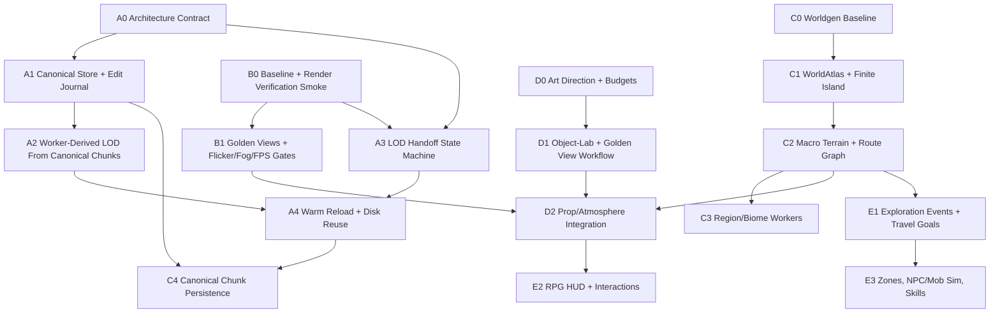

# 2026-05-09 Master Execution Plan

## Outcome

Build the voxel prototype into a Morrowind-like exploration RPG with:

- correct renderer and LOD ownership: no gaps, no overlaps, no z-fighting-like flicker, no fog/LOD mismatch;
- performance truth: measured frame timing, hitches, worker cost, reload cost, and visual correctness artifacts;
- canonical persisted world data: generated chunks and edit deltas are the source of truth; summaries and LOD are derived;
- a finite, authored-procedural island: large coherent regions, routes, caves, landmarks, and region identity;
- RPG exploration systems: discovery, travel goals, skills, NPC/mob zones, and non-Minecraft interaction verbs;
- disciplined evidence: every meaningful change updates the diary, produces artifacts, and is rated against the rubric.

## Rubric

| Area | Target | Gate |
| --- | ---: | --- |
| Render correctness | 10/10 | `0` LOD gaps, handoff holes, resident overlaps, band overlaps, water overlaps in smoke and route probes. |
| Performance truth | 10/10 | Reported FPS within 10% of RAF-derived FPS; p95 frame wall within budget; hitch buckets catch max spikes. |
| LOD/storage architecture | 9/10 | Warm reload reuses canonical disk data; derived LOD can be discarded and rebuilt correctly from chunks + edits. |
| World definition | 8/10 | Fixed route/golden views read as alien island regions, not generic voxel terrain. |
| Exploration/gameplay | 7/10 | Deterministic route goal, discovery journal, skills, and inspect/read/use verbs work without block-building UI. |
| Harness maturity | 10/10 | One smoke command gives JSON + screenshots + reproduction commands for failures. |

## Dependency Graph

## Track Ownership

### Self: Integration + Current P0 Engine Slice

Own:

- current uncommitted LOD worker derivation changes;
- far-transition overlap diagnosis;
- integration of subagent outputs;
- final validation, diary, commit, and push.

Immediate tasks:

- `P0-1`: finish worker-derived LOD2+ path or back out unsafe parts.
- `P0-2`: restore far-transition probe to `0` gaps and `0` overlaps.
- `P0-3`: run `typecheck`, focused LOD tests, default persistence, far persistence.
- `P0-4`: commit/push a clean checkpoint before broader world/gameplay work.

Files reserved for self until checkpoint:

- `src/engine/procedural-resident-world.ts`
- `src/engine/async-chunk-generation.ts`
- `src/client/async-procedural-chunk-generation.ts`
- `src/client/procedural-generation-worker.ts`
- `src/client/game-controller.ts`
- `scripts/run-browser-game-benchmarks.ts`
- `tests/procedural-resident-world.test.ts`
- `docs/loop/20260508-lod-storage-redesign.md`

### Track A: Canonical Storage + LOD Architecture

Task IDs:

- `A0`: write the architecture contract: canonical chunks + edit journal are durable; LOD/summaries are derived.
- `A1`: design `ChunkStore` and edit journal APIs.
- `A2`: derive LOD from canonical chunks in workers.
- `A3`: formalize LOD states and activation path.
- `A4`: warm reload and canonical disk reuse.
- `A5`: tests for edit-aware LOD and reload correctness.

Dependencies:

- `A0` before `A1/A2/A3`.
- `A1` before edit-aware worker LOD.
- `A3` can start as tests while `A1` is in progress.

Parallel-safe first assignment:

- Produce a code-facing design note only; do not edit self-reserved engine files until `P0` checkpoint lands.

### Track B: Render Verification Harness

Task IDs:

- `B0`: baseline inventory.
- `B1`: `scripts/run-render-verification.ts` smoke runner.
- `B2`: golden view registry.
- `B3`: LOD coverage scenarios.
- `B4`: static flicker/z-fighting detector.
- `B5`: fog mismatch detector.
- `B6`: FPS truth and hitch buckets.
- `B7`: scenario matrix and gates.

Dependencies:

- `B0` first.
- `B1/B6` can run immediately.
- `B3` depends on current `probeLodCoverage` fields but can start with existing data.
- `B4/B5` depend on screenshot capture helpers.

Parallel-safe first assignment:

- New script/library files and tests only; do not change renderer or `GameController` yet.

### Track C: World Generation Redesign

Task IDs:

- `C0`: baseline current worldgen artifacts.
- `C1`: extract `WorldAtlas` design.
- `C2`: finite island mask.
- `C3`: region graph.
- `C4`: macro terrain splines.
- `C5`: route graph.
- `C6`: region identity camera atlas.
- `C7`: cave graph.
- `C8-C11`: biome workers for Red Mountain, Bitter Coast, West Gash, Ashlands.
- `C12-C16`: canonical chunk persistence and source-of-truth cleanup.

Dependencies:

- `C0/C1` before generator changes.
- `C2/C3/C4` before biome workers.
- `C12-C16` depend on Track A architecture.

Parallel-safe first assignment:

- Write atlas/worldgen design and validation spec; do not touch generator code until engine checkpoint and baseline artifacts are stable.

### Track D: Art Direction, Assets, Atmosphere, HUD

Task IDs:

- `D0`: visual baseline and budgets.
- `D1`: art direction bible.
- `D2`: object-lab batch gates.
- `D3`: golden view registry.
- `D4-D7`: prop kits: pilgrim, ruin, ash ecology, salt/fungal.
- `D8-D10`: sky, fog, lighting/material grounding.
- `D11-D12`: RPG HUD and discovery/objective tone pass.

Dependencies:

- `D0/D1` before asset changes.
- `D2/D3` before accepting model/atmosphere work.
- `D8-D10` depend on Track B screenshot/performance gates.

Parallel-safe first assignment:

- Write art bible and object-lab/golden-view acceptance docs; avoid asset code until baseline budgets exist.

### Track E: Gameplay + Exploration Loop

Task IDs:

- `E0`: gameplay baseline and gates.
- `E1`: exploration event model.
- `E2`: inspect/read/use interactions.
- `E3`: travel goals and route journal.
- `E4`: encounter zone descriptors.
- `E5`: passive NPC/mob simulation harness.
- `E6`: first rendered NPC/mob silhouettes.
- `E7`: skill-driven exploration decisions.
- `E8`: pathing/physics validation.
- `E9`: NPC/mob pathing MVP.

Dependencies:

- `E1` before `E2/E3/E7`.
- `E4` depends on worldgen route/region shape from Track C, but descriptor design can start now.
- `E6/E9` depend on `E4/E5` and render/harness stability.

Parallel-safe first assignment:

- Write gameplay event/zone design and add no runtime code until the current engine checkpoint lands.

## Parallel Execution Plan

Wave 1, immediately:

- Self: finish `P0` LOD worker/correctness checkpoint.
- Track B: implement render-verification smoke skeleton in new files.
- Track C: produce world atlas design/spec.
- Track D: produce art direction bible and object-lab/golden-view acceptance spec.
- Track E: produce gameplay event/zone/interaction spec.
- Track A: refine canonical storage/LOD architecture note against the current code and research docs.

Wave 2, after `P0` checkpoint:

- Track A starts `ChunkStore`/edit-journal implementation.
- Track B expands smoke runner into golden/flicker/fog/FPS gates.
- Track C extracts `WorldAtlas` behind compatibility wrappers.
- Track D starts object-lab batch improvements and first prop-family pass.
- Track E starts pure exploration event tests.

Wave 3, after Track A storage boundary and Track B smoke are stable:

- Worker LOD derives from canonical chunks + edits.
- Finite island and macro terrain replace infinite biome soup.
- Route graph and travel goals become first-class.
- HUD switches to place/objective/skill/interaction presentation.

## Required Checkpoint Discipline

Every checkpoint must include:

- diary entry;
- exact commands run;
- artifact paths for browser/script verification;
- rubric delta;
- unresolved risks and next target;
- commit and push when clean.

No content-heavy work should be accepted if the render smoke reports gaps, overlaps, or unverifiable frame timing.
