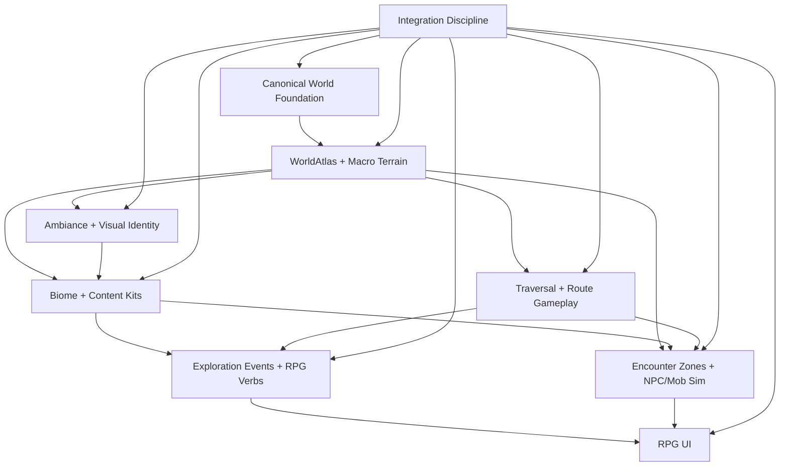

# 2026-05-09 RPG World Roadmap

## Purpose

This roadmap turns the long-term Morrowind-like exploration goal into concrete work streams for world generation, content, traversal, ambiance, skills, NPCs, UI, and verification. It is intentionally practical: each task has dependencies, parallelization notes, and gates that can be proven with existing docs, tests, scripts, or narrow new harness work.

The target is not a larger Minecraft. The target is a strange finite island RPG where the player reads terrain, follows roads, finds landmarks, records discoveries, grows exploration skills, meets passive world inhabitants, and uses inspect/read/use verbs instead of block-building verbs.

## Source Context

Use these existing repo anchors while implementing the roadmap:

- `docs/loop/20260509-master-execution-plan.md`: current Track A-E dependency framing.
- `docs/loop/20260509-world-atlas-design.md`: finite island, region graph, macro terrain, routes, caves, and canonical source-of-truth boundary.
- `docs/loop/20260509-art-direction-bible.md`: enforceable visual pillars, prop families, atmosphere rules, anti-goals, and object-lab gates.
- `docs/loop/20260509-gameplay-exploration-plan.md`: exploration event model, inspect/read/use verbs, travel goals, encounter zones, skills, pathing.
- `docs/loop/20260507-morrowind-rpg-diary.md`: operating strategy, long-term rubric, cycle log, and verification expectations.
- `docs/loop/worldgen-notes.md`: current generator baseline, biome families, landmark lessons, and verification style.
- `docs/loop/verification.md`: route atlas, view atlas, smoke, benchmark, and trace artifact conventions.
- `scripts/run-voxel-rpg-verification.ts`, `scripts/run-render-verification.ts`, `scripts/route-atlas.ts`, `scripts/capture-view-atlas.ts`, `scripts/object-lab.ts`, `scripts/owned-browser-lab.ts`, and `scripts/verify-smoke.ts`: preferred automation surfaces.
- Existing focused tests such as `tests/world-atlas.test.ts`, `tests/exploration-events.test.ts`, `tests/exploration-objectives.test.ts`, `tests/exploration-interactions.test.ts`, `tests/exploration-skill-effects.test.ts`, `tests/rpg-ui-cleanup.test.ts`, `tests/travel-goals.test.ts`, `tests/ambient-environment.test.ts`, `tests/procedural-generator.test.ts`, and LOD/render tests.

User-provided inspiration docs/images, if available in a local working copy, should be treated only as high-level tone input: alien ecology, dense atmosphere, ancient road culture, legible routes, quiet RPG UI, and non-modern ruin language. Do not copy assets, layouts, names, or text directly.

## Outcome Definition

The project reaches the first long-term RPG/world milestone when a clean branch can demonstrate:

- A finite island with named regions, coast/ocean boundary, Red Mountain-scale skyline, roads, caves, and landmark cadence.
- Multiple biome/content teams can add region-specific objects and rules without colliding in the same runtime files.
- A player can traverse route legs, inspect/read/use world objects, complete travel goals, and persist journal/skill progress.
- Ambient profile, sky, fog, material, prop, and route evidence make regions recognizable before reading debug text.
- NPC/mob zones exist as deterministic descriptors before full actor behavior; first passive actor silhouettes are inspectable later.
- Mainline HUD has no hotbar, material inventory, craft grid, block placement prompt, or mining-first language.
- Verification produces JSON plus screenshots for world definition, traversal, ambiance, interactions, skills, render correctness, and performance.

## Work Streams

### Stream 0: Integration And Checkpoint Discipline

Purpose:

Keep parallel work mergeable while engine and content systems evolve.

Tasks:

| ID | Task | Dependencies | Parallel Notes | Gate |
| --- | --- | --- | --- | --- |
| `S0.1` | Maintain a reserved-file list before each wave. | Current `git status -sb` and master execution plan. | Required before assigning sub-work. | No parallel task edits another owner's reserved files. |
| `S0.2` | Keep a cycle diary entry for every implementation slice. | Existing diary format. | Can be done by the slice owner. | Entry names commands, artifacts, failures, rubric movement. |
| `S0.3` | Run pre-merge status/diff review. | All implementation streams. | Integration owner only. | Staged set contains only intended files. |
| `S0.4` | Keep failed large attempts recoverable. | Meaningful code has landed. | Integration owner only. | Commit/revert over destructive discard when appropriate. |

Acceptance:

- No unrelated user changes are reverted.
- Every runtime change has a nearby focused test or artifact.
- Every wave has a known integration branch state before the next wave starts.

### Stream 1: Canonical World Foundation

Purpose:

Separate authored world intent, generated pristine chunks, player edits, and derived render/LOD caches. The RPG world cannot scale if derived LOD summaries become authoritative world data.

Tasks:

| ID | Task | Dependencies | Parallel Notes | Gate |
| --- | --- | --- | --- | --- |
| `S1.1` | Write or update the architecture contract for `WorldAtlas`, `ProceduralWorldGenerator`, `ChunkStore`, edit journal, summaries, and LOD. | `20260509-world-atlas-design.md`, LOD architecture docs. | Documentation-only, safe immediately. | Contract states durable vs derived data explicitly. |
| `S1.2` | Define chunk identity, versioning, and migration policy. | `S1.1`. | Can happen beside tests. | Old saved/generated chunks are rejected, migrated, or rebuilt deterministically. |
| `S1.3` | Add canonical chunk store API and pure tests. | `S1.1`, current P0 engine checkpoint. | Avoid render/stream files until ownership clears. | Save/load/edit replay round trips. |
| `S1.4` | Make derived LOD rebuild from canonical chunks plus edit journal. | `S1.3`, LOD handoff stability. | Coordinate with render owner. | LOD caches can be discarded and recreated without visual mismatch. |
| `S1.5` | Add warm reload/cold reload benchmark counters. | `S1.3`, existing browser benchmark harness. | Can be owned by harness stream. | Revisit reports non-zero canonical reuse and no hole regressions. |

Verification:

- `bun test tests/generated-chunk-codec.test.ts tests/generated-chunk-transfer.test.ts tests/procedural-deferred-persistence.test.ts`
- `bun test tests/lod-handoff.test.ts tests/lod-system.test.ts tests/procedural-resident-world.test.ts`
- `bun run bench:lod-persistence`
- `bun run verify:render -- --label=canonical-store-smoke`

### Stream 2: WorldAtlas And Macro Terrain

Purpose:

Replace infinite biome soup with a finite authored-procedural island that has geography, identity, and travel intent.

Tasks:

| ID | Task | Dependencies | Parallel Notes | Gate |
| --- | --- | --- | --- | --- |
| `S2.1` | Lock island envelope, coordinate helpers, and sampling units. | WorldAtlas design. | Pure code/tests can begin after architecture review. | Grid sample proves finite land/ocean boundary. |
| `S2.2` | Implement region graph sampling. | `S2.1`. | Can run beside route/cave data design. | Region centers and 70% core samples resolve as expected. |
| `S2.3` | Add macro terrain layers: island base, Red Mountain, ridges, basins, coast/shelf. | `S2.2`. | Terrain lab owner can work independently. | Fixed cameras show skyline and region-scale relief. |
| `S2.4` | Add route graph: old roads, pilgrim routes, passes, shelf causeways. | `S2.2`; gameplay goals can design against placeholder routes. | Route authoring can be data-only first. | Every route leg has navigable candidate samples. |
| `S2.5` | Add cave graph and underground entrances. | `S2.2`, traversal probes. | Cave design can start before meshing changes. | Entrances are discoverable, reachable, and not hidden by LOD/fog. |
| `S2.6` | Convert generator to sample atlas fields behind compatibility wrappers. | `S2.1-S2.5`, integration checkpoint. | Serial with generator owner. | Existing biome tests pass or are intentionally migrated. |

Verification:

- `bun test tests/world-atlas.test.ts tests/world.test.ts tests/procedural-generator.test.ts tests/procedural-probes.test.ts`
- `bun run lab:terrain -- --label=macro-terrain`
- `bun run atlas:routes -- --label=atlas-worldgraph`
- `bun run atlas:views -- --label=macro-terrain`

World Definition Rubric:

| Score | Definition |
| ---: | --- |
| `1` | World is mostly noise fields and generic voxel terrain. |
| `2` | Biome variety exists, but route, region, and skyline identity are weak. |
| `3` | Named regions, route graph, landmarks, and ambient profiles are measurable. |
| `4` | Fixed route/golden views are recognizable without debug labels; notable gaps are controlled. |
| `5` | Island reads as a coherent RPG place with region transitions, skyline memory, road culture, caves, and meaningful coast. |

Minimum first milestone: `4`.

### Stream 3: Parallel Biome And Content Kits

Purpose:

Let content work proceed in parallel by giving each region/family a scoped data surface, acceptance gates, and route-view obligations.

Parallel Assignments:

| Team | Scope | Primary Files | Depends On | Must Not Touch |
| --- | --- | --- | --- | --- |
| `C-red` | Red Mountain, Ashen Badlands, ash ecology, pilgrim/Velothi route props. | Biome doc/spec, object definitions, atlas data, tests. | `S2.2`, art bible. | Core renderer/LOD unless assigned. |
| `C-wet` | Bitter Coast, salt marsh basin, silt mist, blackwater roots, shells, reeds. | Biome doc/spec, object definitions, atlas data, tests. | `S2.2`, art bible. | Core generator migration unless assigned. |
| `C-east` | Grazelands, glass-shard coast, shard ridges, cairn chains, dry/cold profiles. | Biome doc/spec, object definitions, atlas data, tests. | `S2.2`, art bible. | Gameplay event runtime unless assigned. |
| `C-west` | West Gash, ravines, passes, redleaf valleys, highland route thresholds. | Biome doc/spec, object definitions, atlas data, tests. | `S2.2`, route graph. | Storage/LOD files unless assigned. |
| `C-inner` | Inner Sea, moor shelf, shrine crossings, old-road junctions. | Biome doc/spec, route objects, landmarks, tests. | `S2.4`, gameplay goals. | Actor simulation unless assigned. |

Shared tasks:

| ID | Task | Dependencies | Gate |
| --- | --- | --- | --- |
| `S3.1` | Define each biome's region promise: skyline, local traversal, materials, landmarks, sounds/ambiance hooks, hazards. | Art bible and atlas. | One-page content contract per region. |
| `S3.2` | Add object-lab samples for each prop family. | `S3.1`. | Object-lab metrics pass family budgets. |
| `S3.3` | Place props against route roles: breadcrumb, threshold, vista anchor, shelter, hazard warning, cave clue. | `S2.4`, `S3.2`. | Route atlas reports cadence and no long empty stretches. |
| `S3.4` | Add regional material/accent rules without single-hue dominance. | `S2.6`. | Screenshot color distributions remain varied. |
| `S3.5` | Add per-region golden views and before/after summaries. | `S3.3`. | View atlas shows visible, nonblank, bounded content. |

Biome Content Rubric:

| Score | Definition |
| ---: | --- |
| `1` | Region differs mainly by material color. |
| `2` | Region has unique landmarks but weak traversal role. |
| `3` | Region has route props, vista anchors, and ambient identity. |
| `4` | Region teaches the player where to go through terrain and prop cadence. |
| `5` | Region has memorable ecology, road culture, silhouette language, and route/cave gameplay hooks. |

Minimum first milestone: every major region at `3`, at least three at `4`.

### Stream 4: Traversal And Route Gameplay

Purpose:

Make movement through the world reliable, readable, and tied to explicit travel goals.

Tasks:

| ID | Task | Dependencies | Parallel Notes | Gate |
| --- | --- | --- | --- | --- |
| `S4.1` | Define traversal envelope: slopes, jumpable gaps, water/shore rules, cave entrances, road comfort. | Macro terrain and player physics. | Pure spec/tests first. | Tests define pass/fail movement constraints. |
| `S4.2` | Add route continuity validator over atlas routes. | `S2.4`, `S4.1`. | Harness owner can implement. | Reports no impossible leg in required routes. |
| `S4.3` | Add browser route probes for old road, coast crossing, highland pass, cave approach. | `S4.2`, browser lab. | Can run beside content. | No stuck, hole, collision, or input regressions. |
| `S4.4` | Add route goal progression from live traversal. | Exploration events, route graph. | Gameplay owner. | One staged browser route advances partial to complete. |
| `S4.5` | Add movement affordances only if needed: road speed comfort, slope feedback, rest/camp marker. | `S4.3`, skill effects. | Serial with UI and skills. | Affordances are RPG verbs, not builder mechanics. |

Verification:

- `bun test tests/player-physics.test.ts tests/first-person-camera.test.ts tests/travel-goals.test.ts tests/exploration-objectives.test.ts`
- `bun run trace:route -- --label=route-traversal`
- `bun run lab:browser -- --label=route-traversal`
- `bun run verify:rpg -- --label=travel-goals`

Traversal Rubric:

| Score | Definition |
| ---: | --- |
| `1` | Movement works at origin but route reliability is unknown. |
| `2` | Basic walking/jumping works, but route legs can strand players. |
| `3` | Required routes have automated continuity and browser probes. |
| `4` | Terrain, roads, water edges, caves, and props guide movement without constant HUD dependence. |
| `5` | Traversal produces RPG decisions: route choice, preparation, skill advantage, and readable risk. |

Minimum first milestone: `3.5`.

### Stream 5: Ambiance, Sky, Fog, Audio Hooks, And Visual Identity

Purpose:

Make place identity visible and measurable, while preserving render correctness. Fog and atmosphere must reveal silhouettes and mood, not hide broken LOD or absent content.

Tasks:

| ID | Task | Dependencies | Parallel Notes | Gate |
| --- | --- | --- | --- | --- |
| `S5.1` | Expand ambient profile sampling from biome-only to region/edge/underground/context-aware rules. | Region graph. | Pure tests before renderer changes. | Centers and route samples expose expected profiles. |
| `S5.2` | Add sky/fog color distribution checks to view atlas. | Existing view atlas. | Harness owner. | Profiles are distinguishable in screenshots. |
| `S5.3` | Add region-specific sky shelves, horizon haze, and lighting tints. | `S5.1`, render gates. | Serial with render owner. | LOD/fog mismatch gates remain zero. |
| `S5.4` | Add ambient sound hook descriptors as data, not full audio system. | Region graph, gameplay zones. | Can be data-only. | Browser/debug snapshot can report active soundscape id later. |
| `S5.5` | Add underground darkness/local light rules. | Cave graph, render gates. | Coordinate with traversal. | Underground is readable, not flat black. |

Verification:

- `bun test tests/ambient-environment.test.ts tests/water-visuals.test.ts tests/view-atlas-budgets.test.ts`
- `bun run atlas:views -- --label=ambient-profiles`
- `bun run verify:render -- --label=ambient-profiles`
- `bun run analyze:screenshot -- --label=ambient-profiles`

Ambiance Rubric:

| Score | Definition |
| ---: | --- |
| `1` | Lighting/fog is generic. |
| `2` | Profiles exist but mostly appear in debug labels. |
| `3` | Region profiles are visible in screenshots and route atlas. |
| `4` | Sky, horizon, fog, material grounding, and props agree per region. |
| `5` | Region mood is recognizable from a single view and remains compatible with performance and LOD gates. |

Minimum first milestone: `4`.

### Stream 6: Exploration Events, Skills, And RPG Verbs

Purpose:

Turn world contact into RPG state: discovery, inspection, reading, use, travel memory, skill XP, and skill-gated decisions.

Tasks:

| ID | Task | Dependencies | Parallel Notes | Gate |
| --- | --- | --- | --- | --- |
| `S6.1` | Finalize exploration event version contract. | Gameplay plan. | Pure tests first. | Idempotency and import/export pass. |
| `S6.2` | Implement inspect/read/use target snapshot. | Event contract, object/landmark ids. | Can use placeholder targets. | Snapshot is authoritative for HUD/browser. |
| `S6.3` | Connect verbs to route journal and skill awards. | `S6.1-S6.2`, route graph. | Gameplay owner. | First inspect/read/use are verified end to end. |
| `S6.4` | Add bounded skill effects that create options. | Current skill effects, traversal goals. | Coordinate with traversal and UI. | Effects change scan/route/use choices without power creep. |
| `S6.5` | Add non-combat use verbs: mark route, record shrine, read sign, inspect tracks, rest note. | Content kits and event model. | Parallel content teams can add candidates. | No block-building UI returns. |

Verification:

- `bun test tests/exploration-events.test.ts tests/exploration-journal.test.ts tests/skill-journal.test.ts`
- `bun test tests/exploration-interactions.test.ts tests/exploration-skill-effects.test.ts tests/rpg-ui-cleanup.test.ts`
- `bun run lab:browser -- --label=rpg-verbs`
- `bun run verify:rpg -- --label=rpg-verbs`

Skills Rubric:

| Score | Definition |
| ---: | --- |
| `1` | Skills are counters only. |
| `2` | Skills gain deterministic XP and persist. |
| `3` | Skills affect scan radius, travel accounting, or objective interpretation. |
| `4` | Skills unlock or improve exploration choices such as reading tracks, marking routes, finding caves, or interpreting shrines. |
| `5` | Skills define player identity without becoming combat stat inflation or grind loops. |

Minimum first milestone: `3.5`.

Non-Minecraft Mechanics Rubric:

| Score | Definition |
| ---: | --- |
| `1` | Hotbar/build/mine language dominates. |
| `2` | Builder UI is reduced but interaction model is still ambiguous. |
| `3` | Inspect/read/use verbs are authoritative and tested. |
| `4` | Core loop is route, journal, skill, and world-object driven. |
| `5` | The game would still make sense if block placement never existed. |

Minimum first milestone: `4`.

### Stream 7: NPCs, Mobs, Zones, And Encounter Simulation

Purpose:

Add inhabitants without jumping straight to combat or expensive AI. The first reliable layer is deterministic zones and passive simulation.

Tasks:

| ID | Task | Dependencies | Parallel Notes | Gate |
| --- | --- | --- | --- | --- |
| `S7.1` | Add encounter zone descriptors for route, biome, cave, shrine, and hazard contexts. | Region graph, route graph, content kits. | Data-only and parallel-safe. | Zone query is deterministic and budgeted. |
| `S7.2` | Add passive actor simulation harness with fixed tick, budget, and visibility rules. | `S7.1`. | Pure data sim first. | Sim remains stable under route probes. |
| `S7.3` | Define first actor families: pilgrim, shrine keeper placeholder, forager creature, territorial fauna, ambient swarm marker. | Art bible and zones. | Content teams can draft. | Families have silhouettes, tags, and inspect text. |
| `S7.4` | Render first low-cost silhouettes. | `S7.2`, render gates, object-lab. | Serial with render owner. | View/browser probes see actors without perf regressions. |
| `S7.5` | Add local steering/pathing MVP. | `S4.2`, `S7.2`. | Later wave. | Actors do not clip, fall, or block required routes. |

Verification:

- `bun test tests/exploration-events.test.ts tests/exploration-interactions.test.ts`
- New focused zone/sim tests when implemented.
- `bun run atlas:routes -- --label=encounter-zones`
- `bun run verify:rpg -- --label=encounter-zones`

Acceptance:

- Encounter zones can be queried by world position and report expected budgets/tags.
- First passive encounter can create an `encounter` or `inspect` event.
- No combat, loot, or aggro system is required for the first milestone.

### Stream 8: RPG UI And Player-Facing Information

Purpose:

Keep the UI quiet, compact, and RPG-forward. The world should be the main screen; UI should clarify current route, place, skill, and interaction target.

Tasks:

| ID | Task | Dependencies | Parallel Notes | Gate |
| --- | --- | --- | --- | --- |
| `S8.1` | Define HUD snapshot contract: place, active goal, focus skill, interaction target, route note. | Gameplay events, route goals. | Pure type/tests first. | Browser snapshots expose all required fields. |
| `S8.2` | Remove or keep suppressed any builder UI surfaces in normal mode. | Current UI cleanup tests. | UI owner. | `rpg-ui-cleanup` stays green. |
| `S8.3` | Add one active travel goal presentation. | `S4.4`, `S6.3`. | UI/gameplay coordination. | Goal text fits and updates from state. |
| `S8.4` | Add bottom interaction prompt from authoritative snapshot. | `S6.2`. | UI owner. | Prompt shows one verb/target/disabled reason. |
| `S8.5` | Add compact journal/skill debug surfaces for tests, not a full quest log. | Skills and route journal. | Browser harness owner can validate. | Import/export and snapshots are enough for automation. |

Verification:

- `bun test tests/rpg-ui-cleanup.test.ts tests/exploration-interactions.test.ts tests/travel-goals.test.ts`
- `bun run lab:browser -- --label=rpg-ui`
- `bun run verify:rpg -- --label=rpg-ui`

Acceptance:

- Normal gameplay shows no hotbar/craft/inventory/mining prompt.
- The HUD never duplicates gameplay logic that belongs in event/interaction snapshots.
- Text fits on desktop and mobile viewport probes.

## Milestone Plan

### Milestone 1: Proven Road Slice

Goal:

One route from a wet or inner-sea start toward an ash/old-road landmark is playable and verified.

Required:

- Island/region graph exists behind tests.
- Route graph has at least one validated old-road leg.
- Ambient profile is visible and screenshot-distinguishable.
- Player can inspect/read/use at least three route objects.
- Travel goal advances from partial to complete in browser.
- Skills gain and persist progress.
- No block-building UI in normal route flow.
- Render correctness remains clean.

Suggested commands:

- `bun run typecheck`
- `bun test tests/world-atlas.test.ts tests/exploration-events.test.ts tests/exploration-interactions.test.ts tests/travel-goals.test.ts tests/rpg-ui-cleanup.test.ts`
- `bun run atlas:routes -- --label=proven-road-slice`
- `bun run atlas:views -- --label=proven-road-slice`
- `bun run verify:rpg -- --label=proven-road-slice`
- `bun run verify:render -- --label=proven-road-slice`

### Milestone 2: Region Triangle

Goal:

Three regions read differently in terrain, props, ambiance, route behavior, and interactions.

Required:

- Red Mountain/Ashen route, wetland/silt route, and glass/salt or highland route have route-atlas coverage.
- Each has at least one vista anchor, threshold prop, breadcrumb prop, and readable travel goal.
- Each has region-specific atmosphere and material palette without single-hue dominance.
- At least one cave/underground entrance is reachable and discoverable.
- Encounter zones exist as data for all three regions.

Suggested commands:

- `bun run lab:object -- --label=region-triangle`
- `bun run lab:terrain -- --label=region-triangle`
- `bun run atlas:routes -- --label=region-triangle`
- `bun run atlas:views -- --label=region-triangle`
- `bun run verify:rpg -- --label=region-triangle`

### Milestone 3: Island Loop Foundation

Goal:

The finite island supports a loop around multiple regions with persistent route memory, skill progression, and stable streaming.

Required:

- Island boundary, coast, shelf, and ocean are proven by atlas sampling.
- Required routes connect at least five major regions.
- Cave graph has multiple reachable entrances.
- Passive zones and first actor silhouettes are visible on at least one route.
- Warm reload reuses canonical world data without derived-cache authority.
- View/render/rpg smoke commands are stable enough for PR gates.

Suggested commands:

- `bun run verify:smoke -- --label=island-loop`
- `bun run verify:rpg -- --label=island-loop`
- `bun run verify:render -- --label=island-loop`
- `bun run bench:browser-game -- --label=island-loop`
- `bun run bench:lod-persistence -- --label=island-loop`

## Verification Gates

Every feature slice should choose the smallest meaningful gate set from this table:

| Gate | Use When | Minimum Signal |
| --- | --- | --- |
| Unit tests | Pure data, math, event, persistence, UI snapshot logic. | Determinism, idempotency, import/export, budget math. |
| `atlas:routes` | Region, route, landmark, discovery, travel-goal, or biome cadence changes. | Aggregate cadence, notable gap, target path, route summary. |
| `atlas:views` | Visual identity, sky/fog, prop, region, or skyline changes. | Nonblank screenshots, view metrics, before/after comparison. |
| `lab:object` | New prop/model family. | Clipping, silhouette, material variety, cross-view variation. |
| `lab:terrain` | Macro terrain, coast, roads, caves, or traversal surface changes. | Slope, height, continuity, water/coast metrics. |
| `lab:browser` | Player input, HUD, progression, persistence, interaction, route movement. | Live state changes and no LOD/hole/input failures. |
| `verify:rpg` | Cross-system RPG loop slices. | One-command status for world/travel/events/skills/UI. |
| `verify:render` | LOD, fog, screenshots, frame timing, render correctness. | Zero gaps/overlaps/holes and budgeted frame metrics. |
| Browser benchmark | Streaming, storage, actor, route, or rendering cost changes. | p95/max frame, heap, pending work, hitch buckets. |

Hard correctness gates:

- `LOD gaps = 0`.
- `handoff holes = 0`.
- `residentOverlapCount = 0`.
- `bandOverlapCount = 0`.
- Water/terrain overlaps remain within current accepted bounds or improve.
- Browser route probes do not strand the player.
- Progress import/export round trips.
- Replayed event batches do not double-award XP or objective progress.
- Normal UI does not expose hotbar, craft grid, material inventory, break/place prompt, or mining-first copy.

## Dependency Map

## Parallelization Rules

- Documentation, content contracts, object-lab fixtures, route/golden-view definitions, pure tests, and data-only descriptors can run immediately.
- Core generator migration should wait for the current engine/LOD checkpoint and a clear reserved-file list.
- Renderer, LOD, persistence, and `GameController` edits should be serialized or explicitly coordinated.
- Biome teams may work in parallel if each owns a region/content kit and only touches shared runtime integration through reviewed adapters.
- UI work should wait for authoritative snapshots from gameplay systems; it should not invent duplicate state.
- NPC/mob visual work should wait for deterministic zone descriptors and passive simulation tests.

## Definition Of Done For A Roadmap Slice

A slice is done when:

- It names the player-facing behavior or world-definition improvement.
- It updates or adds deterministic tests for the contract.
- It produces the relevant atlas/lab/browser artifacts.
- It documents failures or deferred risk in the diary.
- It keeps unrelated worktree changes untouched.
- It improves or preserves the rubric score it targeted.

The best next implementation target after this document is `Milestone 1: Proven Road Slice`, because it forces worldgen, content, traversal, verbs, skills, UI, ambiance, and render gates to meet in one narrow RPG loop before the island grows wider.
