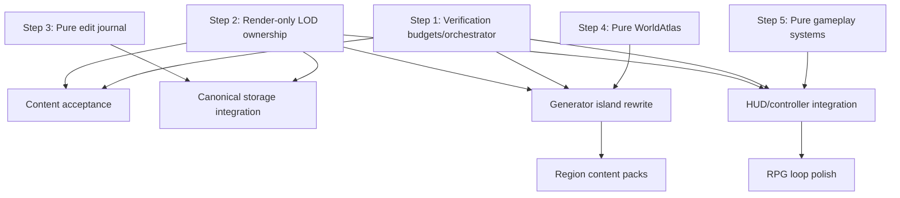

# 2026-05-09 Subagent Execution Board

## Objective

Return to the active long-term goal with a task graph that puts renderer correctness and performance verification first, then unlocks bold world, art, and gameplay changes without letting any subsystem invent a second source of truth.

Target outcome:

- no visible or measured LOD gaps, overlaps, floating chunks, or z-fighting-like ownership bugs;
- true frame/hitch reporting, including movement and LOD transition spikes;
- canonical chunks plus edit deltas as durable world authority;
- finite Morrowind-like island geography with large coherent regions, routes, caves, and landmark cadence;
- RPG-style exploration, discovery, skills, inspect/read/use verbs, and later passive encounters;
- every checkpoint measured, documented, committed, and pushed.

## P0 Rule

Content work can proceed in pure modules and tools, but content is not accepted into the game loop until the render gate is clean. The renderer must be trustworthy enough that screenshots and route probes mean something.

Current P0 is now more specific than the older board: `OpaqueChunkMesher` supports render-only clip masks. The next renderer checkpoint is to replace unsafe data-punching semantics with deterministic canonical-payload plus render-instance clipping, then prove it with unit tests and browser LOD persistence artifacts.

## Multi-Step Plan

### Step 1 - Make Measurement Authoritative

Owner: verification worker, with self reviewing the final gates.

Deliverables:

- central budget module;
- one RPG verification command that collects existing route, browser, LOD, and view artifacts;
- gate summary that separates correctness failures from performance or settle-budget failures;
- diary/rubric draft generated from real artifacts only.

Dependencies:

- can start immediately;
- must not require renderer changes;
- blocks subjective visual/content acceptance.

Acceptance:

- LOD gap/overlap gates are explicit;
- p95/max frame and hitch buckets are reported;
- artifact manifest records command lines and JSON paths.

### Step 2 - Stabilize LOD Ownership

Owner: self.

Deliverables:

- canonical derived LOD payload remains unmodified;
- active render instance carries a transient clip mask or equivalent visibility ownership state;
- mesher receives clip masks from residency when finer active coverage owns the same space;
- prepared/retained/stale chunks are never yielded unless explicitly active;
- same canonical payload can be reused with different render clip masks.

Dependencies:

- uses the mesher clip-mask foundation already pushed;
- must land before any generator rewrite is accepted into the running game.

Acceptance:

- `typecheck`;
- focused mesher/LOD tests;
- default LOD persistence pass;
- far-transition stress reports `0` uncovered gaps, handoff holes, resident overlaps, band overlaps, and water overlaps;
- remaining pending chunks, if any, are classified as non-visible settle backlog rather than correctness failure.

### Step 3 - Prepare Canonical Storage

Owner: storage worker.

Deliverables:

- pure edit-journal module with pack/replay/compact behavior;
- revision-aware record shapes documented and tested;
- no production cache migration until the pure contracts are proven.

Dependencies:

- can start immediately in new files;
- production IndexedDB integration waits for Step 2 and review.

Acceptance:

- edit replay is deterministic;
- repeated voxel edits collapse correctly;
- import/export is stable across negative chunk coordinates and sparse chunks.

### Step 4 - Make the Island Source of Truth

Owner: world atlas worker.

Deliverables:

- tested finite island mask and region graph in `WorldAtlas`;
- route/cave/landmark definitions as data, not generator side effects;
- validation tests for region centers, edge blends, outside-island ocean classification, and route anchors.

Dependencies:

- pure atlas work can start now;
- `ProceduralWorldGenerator` rewrites wait for Step 1 and Step 2 gates.

Acceptance:

- all eight macro regions have stable centers and meaningful area;
- out-of-island sampling returns ocean/shelf/deep water identity;
- route anchors and region edges are deterministic and test-covered.

### Step 5 - Build RPG Gameplay as Pure Systems

Owner: gameplay worker.

Deliverables:

- interaction target resolver for inspect/read/use prompts;
- route journal and travel goals;
- encounter-zone data model and passive simulation contract;
- browser/controller integration deferred until pure tests are clean.

Dependencies:

- pure event/goal work can start now;
- HUD/controller integration waits for renderer and verification gates.

Acceptance:

- idempotent events and goals;
- save/load snapshots stable;
- no Minecraft-style hotbar or block-placement assumptions;
- later browser probe can complete inspect/read/use and route-goal checks.

### Step 6 - Integrate Bold Content

Owner: self plus content workers after gates.

Deliverables:

- finite island macro terrain in generator;
- Red Mountain skyline, wetland/salt/glass/ash region identity, authored route graph, cave graph;
- object-lab acceptance for prop families;
- golden-view and route-atlas before/after metrics.

Dependencies:

- Step 1 verification gate;
- Step 2 renderer ownership gate;
- Step 4 atlas contract.

Acceptance:

- route/view artifacts show visible identity changes;
- FPS/hitch and LOD correctness remain within budget;
- world reads as large-region island, not patchwork voxel biome soup.

## Dependency Graph

## Task Distribution

### Self

Task: `R0` render-only LOD ownership.

Write scope:

- `src/engine/procedural-resident-world.ts`
- `src/engine/lod-clip-mask.ts`
- `src/engine/opaque-chunk-mesher.ts`
- `tests/lod-handoff.test.ts`
- `tests/lod-clip-mask.test.ts`
- `tests/opaque-chunk-mesher.test.ts`
- LOD diary entries

First implementation target:

- feed computed clip masks into LOD mesh building without mutating canonical derived chunk data.

### Verification Worker

Task: `V0` verification budgets and orchestrator.

Write scope:

- `scripts/lib/voxel-rpg-budgets.ts`
- `scripts/run-voxel-rpg-verification.ts`
- `tests/voxel-rpg-budgets.test.ts`
- `tests/voxel-rpg-verification-runner.test.ts`
- `package.json`

Do not edit renderer, generator, controller, or existing benchmark logic unless explicitly asked after review.

### Storage Worker

Task: `S0` pure edit journal foundation.

Write scope:

- `src/engine/chunk-edit-journal.ts`
- `tests/chunk-edit-journal.test.ts`
- optional notes in `docs/loop/20260509-canonical-lod-architecture.md`

Do not edit IndexedDB production cache yet.

### World Atlas Worker

Task: `A0` pure atlas expansion and validation.

Write scope:

- `src/engine/world-atlas.ts`
- `tests/world-atlas.test.ts`
- optional notes in `docs/loop/20260509-world-atlas-design.md`

Do not edit `src/engine/procedural-generator.ts` yet.

### Gameplay Worker

Task: `G0` pure RPG interaction and travel systems.

Write scope:

- `src/engine/exploration-interactions.ts`
- `src/engine/travel-goals.ts`
- `tests/exploration-interactions.test.ts`
- `tests/travel-goals.test.ts`
- optional notes in `docs/loop/20260509-gameplay-exploration-plan.md`

Do not edit `src/client/game-controller.ts` or HUD files yet.

## ROI Order

| Rank | Task | ROI | Reason |
| --- | --- | ---: | --- |
| 1 | `R0` render-only LOD ownership | 10 | Fixes the trust foundation: no meaningful content work matters while the world can render two realities. |
| 2 | `V0` verification orchestrator | 9 | Converts repeated manual checks into one evidence-producing command and prevents false visual/performance claims. |
| 3 | `S0` edit journal foundation | 8 | Enables canonical editable world persistence without risking production cache behavior immediately. |
| 4 | `A0` tested WorldAtlas | 8 | Enables bold island/worldgen changes from a stable data model instead of ad hoc generator patches. |
| 5 | `G0` pure RPG systems | 7 | Adds Morrowind-like loop structure while staying independent of renderer/generator churn. |
| 6 | generator island rewrite | 9 after gates | High player-visible payoff, but unsafe until renderer and atlas gates are trustworthy. |
| 7 | prop/atmosphere content packs | 7 after gates | Good visual payoff, but must be measured through object/view labs to avoid barely visible tweaks. |

## Detailed Task Boards

Subagents expanded the execution plan into two owned roadmap documents:

- `docs/loop/20260509-lod-storage-roadmap.md`: persistent canonical chunks, edit journals, worker-derived LOD, LOD lab/probes, hitch attribution, and storage/OPFS decision points.
- `docs/loop/20260509-rpg-world-roadmap.md`: finite island worldgen, region/content kits, traversal, ambiance, RPG verbs/skills, NPC zones, UI, and rubric-based acceptance.

Immediate scheduling rule:

- Keep `R0` as the current critical path until the browser LOD persistence probe reports zero gaps, holes, resident overlaps, band overlaps, and water overlaps.
- Run storage and RPG work in pure modules/docs only while `R0` is active.
- Do not integrate generator, HUD, route, or prop content changes into the live game loop until the verification board can prove render ownership is clean.
- After `R0`, parallelize `S1` canonical chunk store, `P0` LOD lab/probe expansion, `S2.1-S2.2` island/region atlas foundations, and `S4.1` traversal-envelope specs.

## Evidence Checklist

Every accepted checkpoint must record:

- command list;
- artifact paths;
- LOD gap/overlap counts;
- p95/max frame and hitch buckets for browser-facing changes;
- screenshots/contact sheets for visual changes;
- diary update with rubric delta;
- commit and push.

## 2026-05-09 Regroup After Canonical Cache Checkpoint

Checkpoint landed:

- `a883d83 Use canonical keys for chunk cache`
- The browser IndexedDB generated chunk cache now writes canonical keys and metadata while preserving legacy read fallback.
- This does not complete canonical terrain authority yet. It only makes stored generated chunks easier to address and validate.

Subagent planning synthesis:

- Engine/LOD/storage: the durable authority must be `procedural base chunk + persisted edit journal + live overlay`; summaries and LOD remain derived artifacts.
- Verification/tooling: subagents need one fresh evidence bundle command and hard hitch/LOD gates before their work can be trusted.
- World/gameplay/art: bold island and RPG changes should start as pure atlas/data/gameplay modules, then integrate after render/storage gates are clean.

### Current Critical Path

`P1` replaces the older `R0` label. It is still render/storage-first:

1. `P1-A`: expose canonical chunk records and edit journals through the browser cache API.
2. `P1-B`: persist chunk-scoped edit journals and replay them into an effective canonical chunk.
3. `P1-C`: make worker-derived LOD consume effective canonical chunks or a revision-validated snapshot, never a divergent generator shortcut.
4. `P1-D`: prove LOD handoff in the browser with zero visible gaps/overlaps and no blank transition while a higher-detail chunk is loading.
5. `P1-E`: add warm/cold/edit reload gates that distinguish canonical chunk hits from derived LOD cache hits.

Acceptance for leaving `P1`:

- `typecheck` passes.
- Focused canonical store, edit journal, LOD handoff, and mesher tests pass.
- `bench:lod-persistence` default and far probes report:
  - `0` uncovered gaps,
  - `0` handoff holes,
  - `0` resident overlaps,
  - `0` band overlaps,
  - `0` water overlaps.
- Edited voxel/chunk state survives reload and affects the active LOD for that footprint.
- Any remaining pending-generation counts are reported as settle backlog, not hidden correctness proof.

### Active Assignment Board

| Owner | Task | Write Scope | Dependency | Status |
| --- | --- | --- | --- | --- |
| Self | `P1-A/P1-B` integration: browser cache canonical API, edit journal persistence boundary, parent review of all worker output | `src/client/procedural-generated-chunk-cache.ts`, `src/client/procedural-deferred-persistence.ts`, `src/engine/procedural-resident-world.ts`, persistence/LOD tests, diary | current clean branch | active |
| Verification worker | `V1`: fresh evidence bundle and hitch gates | `scripts/lib/voxel-rpg-budgets.ts`, `scripts/run-voxel-rpg-verification.ts`, render/RPG verifier tests, optional new script helpers | none | assign now |
| LOD lab worker | `L1`: artificial-world LOD browser/test scenarios for one-owner handoff, edit propagation, and smooth field seams | `src/engine/lod-debug-world.ts`, `tests/lod-debug-world.test.ts`, optional `scripts/diagnose-lod-coverage.ts` | none, but no production renderer edits | assign now |
| World atlas worker | `W1`: pure finite island atlas, macro region graph, route/cave anchors, no generator integration | `src/engine/world-atlas.ts`, `tests/world-atlas.test.ts`, `docs/loop/20260509-world-atlas-design.md` | none | assign after a worker slot is free |
| Gameplay worker | `G1`: pure interaction/travel/skill events, no controller or HUD integration | `src/engine/exploration-interactions.ts`, `src/engine/travel-goals.ts`, `src/engine/skill-journal.ts`, related tests | none | assign after a worker slot is free |
| Art/content worker | `D1`: object-lab family budgets and golden-view acceptance profiles | `scripts/object-lab.ts`, `tests/object-lab.test.ts`, `scripts/capture-view-atlas.ts`, `tests/view-atlas-budgets.test.ts` | verification budget conventions | queued |

Parallel-safe right now:

- `V1` and `L1` can run while self works on `P1-A/P1-B`.
- `W1` and `G1` are safe only if kept pure and out of the live generator/controller.
- `D1` should wait until verification budget conventions are stable enough to avoid inventing different pass/fail semantics.

Blocked until `P1` acceptance:

- production generator island rewrite;
- HUD/controller integration;
- prop/atmosphere integration into the live game loop;
- NPC/mob runtime simulation;
- any change that makes screenshots look better by hiding LOD/fog/correctness failures.

### Checkpoint - P1 Support Tools And Pure Atlas

Accepted in this checkpoint:

- Browser cache now exposes canonical chunk read/write methods in addition to the legacy `getChunk`/`putChunk` compatibility path.
- Browser cache schema now includes `chunk_edit_journals`.
- Edit journal persistence has a pure record builder that merges existing deltas with appended deltas, validates append revision, and uses canonical edit-journal keys.
- RPG verification now has named profiles, stale/commit-mismatch artifact checks, and live-forward hitch aggregation separated from render correctness gates.
- LOD lab now has a smooth sinusoidal field fixture plus seam/ownership analysis, so chunk-edge discontinuities and multi-owner/ownerless columns are easier to catch in pure tests.
- WorldAtlas now contains pure cave-system anchors, route anchors, region graph helpers, and area estimates without touching the production generator.

Validation:

- `mise exec -- bun run typecheck`: pass.
- `mise exec -- bun test tests/procedural-generated-chunk-cache.test.ts tests/canonical-chunk-store.test.ts tests/chunk-edit-journal.test.ts tests/procedural-deferred-persistence.test.ts tests/lod-debug-world.test.ts tests/lod-handoff.test.ts tests/frame-timing-buckets.test.ts tests/render-verification-runner.test.ts tests/voxel-rpg-budgets.test.ts tests/voxel-rpg-verification-runner.test.ts tests/world-atlas.test.ts`: pass, `68` tests.
- `mise exec -- bun run bench:lod-persistence -- --label=p1-cache-journal-lod-lab-retry`: pass.
  - Artifact: `/var/folders/h7/xz1x4d4x0cn702r2q9205bkh0000gn/T/voxels-browser-game-bench-KlfGIJ/lod-idb-persistence-reload.json`
  - Reload disk hits: `1277`.
  - First failure: `n/a`.

Rejected/observed:

- First browser run, `p1-cache-journal-lod-lab`, failed with `16` cold-origin uncovered LOD sample gaps despite `pending=0`.
  - Artifact: `/var/folders/h7/xz1x4d4x0cn702r2q9205bkh0000gn/T/voxels-browser-game-bench-L6eGx3/lod-idb-persistence-reload.json`
  - Samples were near the origin and had no owner chunks, matching the earlier cold-origin coverage flake/failure category.
  - This remains a real P1 blocker. The retry only proves the cache schema/edit-journal boundary did not deterministically break reload persistence.

Next:

1. Add repeat/flaky cold-origin coverage detection so a single retry cannot hide ownerless samples.
2. Wire persisted edit journals into the worker/deferred persistence flow.
3. Build an effective canonical chunk source that replays persisted edit journals before any LOD derivation.
4. Keep WorldAtlas generator integration blocked until the LOD coverage flake/failure has a deterministic fix.
